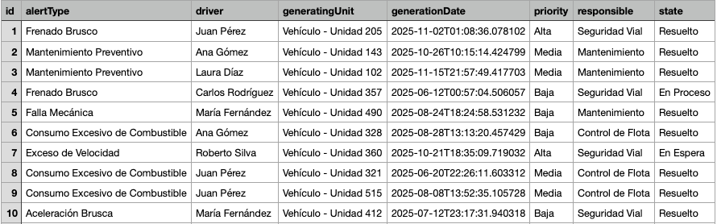

# 🚨 Panel Service - Sistema de Gestión de Alertas

## 📋 Descripción

Panel Service es un microservicio diseñado para gestionar y visualizar alertas de seguridad vehicular en tiempo real. El sistema recibe alertas a través de mensajería RabbitMQ, las almacena en una base de datos PostgreSQL y proporciona una API GraphQL para consultas desde el frontend.

## 🎯 Características Principales

- **Recepción de Alertas**: Escucha mensajes de RabbitMQ con información de alertas vehiculares
- **Almacenamiento Persistente**: Guarda las alertas en PostgreSQL para consultas futuras
- **API GraphQL**: Proporciona endpoints de consulta para visualizar el panel de alertas
- **Información de Alertas**: Rastrea tipo de alerta, responsable, prioridad, conductor, unidad generadora, estado y fecha

## 🏗️ Arquitectura del Proyecto

El proyecto sigue una arquitectura limpia por capas:

```
src/main/java/com/fleetguard360/panel_service/
├── presentation/          # Capa de API (Controllers, DTOs, Manejadores de Excepciones)
│   ├── controller/        # Controladores GraphQL
│   ├── dto/              # Objetos de Transferencia de Datos
│   └── advice/           # Manejador Global de Excepciones
├── service/              # Capa de Lógica de Negocio
│   ├── interfaces/       # Contratos de Servicios
│   ├── implementation/   # Implementaciones de Servicios
│   └── exception/        # Excepciones Personalizadas
├── persistence/          # Capa de Acceso a Datos
│   ├── entity/          # Entidades JPA
│   └── repository/      # Repositorios JPA
└── configuration/        # Capa de Configuración
    ├── RabbitMQConfig    # Configuración de RabbitMQ
    └── AlertMessageListener  # Listener de mensajes
```

## 🚀 Tecnologías Utilizadas

- **Java 21**: Lenguaje de programación
- **Spring Boot 3.5.7**: Framework principal
- **Spring Data JPA**: Persistencia de datos
- **Spring GraphQL**: API GraphQL
- **Spring AMQP**: Integración con RabbitMQ
- **PostgreSQL**: Base de datos
- **Lombok**: Reducción de código boilerplate
- **Gradle**: Gestión de dependencias y build

## 📦 Requisitos Previos

- Java 21 o superior
- PostgreSQL 12 o superior
- RabbitMQ 3.x o superior
- Gradle 8.x (incluido con el wrapper)

## ⚙️ Configuración

### 1. Variables de Entorno

Copia el archivo `.env.example` a `.env` y completa los valores:

```bash
cp .env.example .env
```

Edita el archivo `.env` con tus credenciales:

- **DB_USERNAME**: Usuario de PostgreSQL
- **DB_PASSWORD**: Contraseña de PostgreSQL
- **RABBITMQ_HOST**: Host de RabbitMQ (ej: localhost)
- **RABBITMQ_USERNAME**: Usuario de RabbitMQ
- **RABBITMQ_PASSWORD**: Contraseña de RabbitMQ

### 2. Base de Datos

Crea la base de datos en PostgreSQL:

```sql
CREATE DATABASE panel_db;
```

El esquema de tablas se creará automáticamente al iniciar la aplicación.

### 3. RabbitMQ

Asegúrate de que RabbitMQ esté ejecutándose. El servicio creará automáticamente:
- Cola: `alerts.queue`
- Exchange: `alerts.exchange`
- Routing Key: `alerts.routing.key`

## 🏃 Ejecución

### Modo Desarrollo

```bash
./gradlew bootRun
```

### Compilar y Ejecutar

```bash
./gradlew build
java -jar build/libs/panel-service-0.0.1-SNAPSHOT.jar
```

## 📡 Uso de la API GraphQL

Una vez iniciada la aplicación, puedes acceder a:

- **GraphQL Endpoint**: `http://localhost:8080/graphql`
- **GraphiQL Interface**: `http://localhost:8080/graphiql`

### Consultas Disponibles

#### Obtener todas las alertas

```graphql
query {
  getAllAlerts {
    id
    alertType
    responsible
    priority
    driver
    generatingUnit
    state
    generationDate
    createdAt
  }
}
```

#### Obtener alerta por ID

```graphql
query {
  getAlertById(id: 1) {
    id
    alertType
    responsible
    priority
    driver
    generatingUnit
    state
    generationDate
    createdAt
  }
}
```

## 📨 Formato de Mensaje RabbitMQ

El servicio espera mensajes JSON con la siguiente estructura:

```json
{
  "toUsers": ["usuario1@ejemplo.com", "usuario2@ejemplo.com"],
  "alertType": "Exceso de Velocidad",
  "responsible": "Seguridad Vial",
  "priority": "Alta",
  "driver": "Ana Gómez",
  "generatingUnit": "Vehículo - Unidad 102",
  "state": "Activo",
  "generationDate": "2025-10-24T14:30:00"
}
```

**Nota**: El campo `toUsers` se recibe pero no se almacena en la base de datos.

## 🗂️ Modelo de Datos

### Entidad Alert

| Campo | Tipo | Descripción |
|-------|------|-------------|
| id | Long | Identificador único (generado automáticamente) |
| alertType | String | Tipo de alerta (ej: Exceso de Velocidad) |
| responsible | String | Responsable de atender la alerta |
| priority | String | Prioridad de la alerta (Alta, Media, Baja) |
| driver | String | Nombre del conductor |
| generatingUnit | String | Unidad que generó la alerta |
| state | String | Estado actual de la alerta |
| generationDate | LocalDateTime | Fecha y hora de generación |
| createdAt | LocalDateTime | Fecha de registro en el sistema |

## 🔧 Configuración Adicional

### Cambiar Puerto del Servidor

Modifica `SERVER_PORT` en el archivo `.env`:

```
SERVER_PORT=8081
```

### Habilitar/Deshabilitar GraphiQL

```
GRAPHQL_GRAPHIQL_ENABLED=false
```

### Nivel de Logs

```
LOG_LEVEL=DEBUG
APP_LOG_LEVEL=TRACE
```

Claro, aquí tienes una **guía concisa en Markdown**, lista para incluir en tu `README.md`, que explica cómo debe implementarse la descarga del archivo CSV desde el frontend, considerando tu arquitectura (GraphQL → Gateway → REST CSV):

---

## 📥 Descarga de Archivos CSV desde el Frontend

El microservicio `panel-service` genera archivos `.csv` mediante un endpoint REST protegido. Para descargarlos correctamente desde el frontend, sigue estos pasos:

### 1. Obtén la URL de descarga mediante GraphQL (Api Gateway)

```graphql
query {
  exportAlertsCsvUrl  # devuelve una URL efímera, ej: "/panel/export/alerts.csv?token=abc123"
}
```

### 2. Descarga el archivo con `fetch()` (¡no uses `<a href>`!)

```javascript
const downloadCsv = async () => {
  // 1. Obtén la URL
  const { data } = await client.query({ query: EXPORT_CSV_QUERY });
  const url = data.exportAlertsCsvUrl;

  // 2. Descarga con autenticación
  const token = getAuthToken(); // tu método para obtener el JWT
  const response = await fetch(url, {
    headers: { 'Authorization': `Bearer ${token}` }
  });

  if (!response.ok) throw new Error('Descarga fallida');

  // 3. Crea y dispara la descarga
  const blob = await response.blob();
  const link = document.createElement('a');
  link.href = URL.createObjectURL(blob);
  link.download = 'alerts.csv';
  link.click();
  URL.revokeObjectURL(link.href);
};
```


### ✅ ¿Por qué este enfoque?

- ✔️ El header `Authorization` se incluye (requerido por el `AuthenticationFilter` del gateway).
- ✔️ Soporta archivos grandes sin bloquear la UI.
- ✔️ Funciona en navegadores modernos (Chrome, Firefox, Edge, Safari).
- ✔️ Evita descargar errores HTML (ej: redirección a login).

Primeros datos generados del archivo .csv:



## 🐛 Solución de Problemas

### La aplicación no conecta a PostgreSQL
- Verifica que PostgreSQL esté ejecutándose
- Confirma las credenciales en el archivo `.env`
- Asegúrate de que la base de datos `panel_db` exista

### No se reciben mensajes de RabbitMQ
- Verifica que RabbitMQ esté ejecutándose
- Confirma las credenciales y host en `.env`
- Verifica que el exchange y queue estén configurados correctamente

### Error en GraphQL
- Revisa los logs de la aplicación para más detalles
- Verifica que la sintaxis de tu query sea correcta
- Asegúrate de que existan datos en la base de datos

## 📝 Licencia

Este proyecto está licenciado bajo los términos especificados en el archivo LICENSE.

## 👥 Contribución

Para contribuir al proyecto, por favor sigue las convenciones de código establecidas y asegúrate de que todas las pruebas pasen antes de crear un pull request.

---

**Desarrollado con ❤️ para FleetGuard360**

